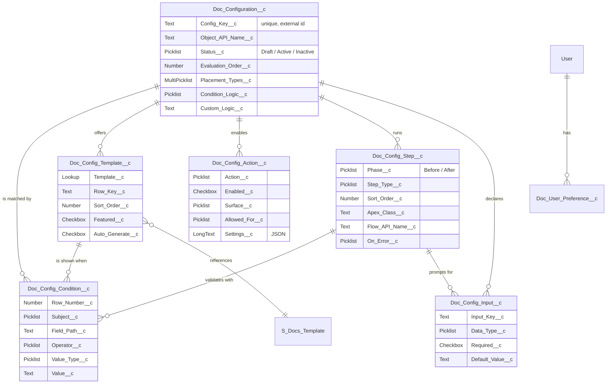
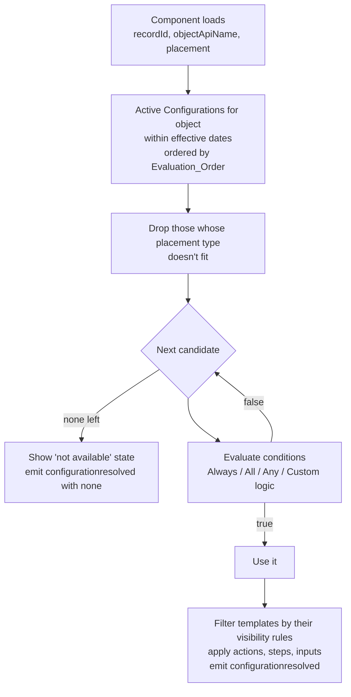

# S-Docs LWC 2.0 — Configuration Data Model

**Status:** Draft for review · **Author:** Anand Narasimhan · **Date:** 2026-10-01

This document defines the data a **business admin** manages to control what the new S-Docs component does: which templates appear, for whom, under which record conditions, which actions are allowed, and what runs before and after generation. It is deliberately independent of the current implementation. Reuse of existing objects and classes is decided in the technical specification.

---

## 1. Goals this model must serve

| Goal | How the model serves it |
|---|---|
| Business admins configure, not Salesforce admins | Everything is **data in custom objects**, edited through an S-Docs wizard. No App Builder, no metadata deploys. |
| Different setups per record / user | A **Configuration** has **conditions** on record fields, parent fields, the running user, groups and permission sets, formulas, or Apex. |
| Ordering when several match | Configurations are **ordered per object; first match wins**. |
| Embeddable in LWCs and screen flows | The same component works on record pages, inside custom LWCs and on flow screens, and picks the first matching Configuration in each. Later phases add **scoping to a placement** (record page, Experience Cloud, screen flow, embedded). |
| Point-and-click action control | Each Configuration lists its **end-user actions** (preview, edit, sign, delete …) with simple per-action settings. |
| Pre-generation actions that feed generation | **Before-generate steps** (validation, user prompt, Apex, Flow) write into declared **generation inputs** that templates merge. |
| Lifecycle events | The component emits a fixed event catalog on DOM events, Lightning Message Service, and Flow outputs. Platform events are opt-in per Configuration. |

---

## 1a. Phase 1 (MVP) scope

Decided 2026-10-02. Phase 1 keeps a Configuration to three things: **when to show**, **which templates** and **which actions**. Everything else in this document is parked for a later phase, not discarded.

| | In Phase 1 | Later phases |
|---|---|---|
| **Configuration** | `Name`, `Config_Key__c`, `Description__c`, `Object_API_Name__c`, `Status__c`, `Evaluation_Order__c`, `Condition_Logic__c` (no conditions = always; otherwise all / any / custom), `Custom_Logic__c` | Placements, active dates, run as system, picker style, multi-select / favorites / regenerate, auto-generate, after-generate behavior, combined output, document-list scope, platform-event opt-in |
| **Conditions** | Record and parent-record fields, user fields, profile, role, permission set, custom permission, public group | Formula and Apex conditions, template visibility rules, validation-step rules |
| **Templates** | `Template__c`, `Row_Key__c`, `Sort_Order__c` | Featured, preselected, auto-generate, group label, display overrides |
| **Actions** | `Action__c`, `Enabled__c`. The component decides where an action shows: actions that work on several documents (Download, Email, Request signature, Refresh, Delete) appear on the toolbar and on each document; the rest appear on each document only. | `Surface__c`, `Allowed_For__c`, `Confirm__c`, `Settings__c` |
| **Not in Phase 1** | — | `Doc_Config_Step__c` (before/after steps), `Doc_Config_Input__c` (generation inputs), `Doc_User_Preference__c` |

**Lightning App Builder (Phase 1):** one design property, **Title**. The component always uses the first matching Configuration by priority, so the Salesforce admin drops it on the page, gives it a title, and the business admin manages everything else. The same applies on flow screens, where the component adds a required **Record ID** input and output values.

**Builder details (Phase 1):** the business admin's troubleshooting switch on the Document Configurations page. When it's on, the S-Docs card on record pages shows, under the card, which Configuration was used, why higher-priority ones were skipped, and each condition marked pass or fail with its actual value.
- The switch is **per person**, so one admin's troubleshooting doesn't change what other admins see.
- Only users with the `SDocs_Configuration_Manager` custom permission can turn it on or see the details. Reps never see them.
- It replaces a "Mode" design property: there's no supported way for a component to know it's on the App Builder canvas, and troubleshooting belongs to the business admin anyway.

Still in Phase 1, because it belongs to the component rather than the admin: the lifecycle events (§6).

## 2. Concepts

| Term | Meaning |
|---|---|
| **Configuration** | A named, ordered rule: *"for this object, in these placements, when these conditions are true, offer these templates and actions and run these steps."* |
| **Scope** | The cheap, structural filter checked first: object, placement type, active dates. |
| **Condition** | One numbered criteria row. Rows combine with *All*, *Any*, or custom logic such as `1 AND (2 OR 3)`. |
| **Placement** | Where the component is running: Record Page, Experience Cloud, Screen Flow, or Embedded LWC. |
| **Generation input** | A named, typed value (e.g. `discount_pct`) that templates can merge. Inputs are filled by defaults, the host, user prompts, Apex, or Flow. |
| **Step** | Something that runs **before** generation (validate, prompt, Apex, Flow) or **after** it (Apex, Flow). |
| **Action** | A button the end user can use on generated documents: preview, download, edit, refresh, versions, delete, email, request signature, sign in person. |

---

## 3. Entity relationship

Seven objects: five configuration children under one parent, plus one small per-user runtime object. Every child uses a **master-detail** to `Doc_Configuration__c`, so a Configuration is cloned, exported, deleted and secured as one unit.

---

## 4. Objects

> Names use the `SDOC__` namespace at runtime and are shown without it here. Picklists are restricted unless noted.

### 4.1 `Doc_Configuration__c` — Configuration

**Identity and scope**

| Field | Type | Notes |
|---|---|---|
| `Name` | Text(80) | Label shown to admins, e.g. *Enterprise Sales — Proposals*. |
| `Config_Key__c` | Text(80), unique, external ID | Developer name, e.g. `opp_enterprise_sales`. Promotion between orgs matches on it, and it identifies the Configuration in lifecycle events. |
| `Description__c` | Long text(2000) | Why this exists and who owns it. |
| `Object_API_Name__c` | Text(255), required | Base object, e.g. `Opportunity`. |
| `Status__c` | Draft · Active · Inactive | Only **Active** Configurations are evaluated. Draft ones can still be run in the wizard's *Test* view. |
| `Evaluation_Order__c` | Number(4,0), required | Lower is evaluated first. Unique per `Object_API_Name__c`; the wizard re-sequences when rows are dragged. |
| `Placement_Types__c` | Multi-select: Record Page · Experience Cloud · Screen Flow · Embedded | Blank = any placement. |
| `Effective_From__c` / `Effective_To__c` | Date | Optional window, for seasonal or pilot setups. |

**Conditions**

| Field | Type | Notes |
|---|---|---|
| `Condition_Logic__c` | Always · All · Any · Custom | *Always* ignores condition rows. Use it for the fallback Configuration at the bottom of the order. |
| `Custom_Logic__c` | Text(255) | e.g. `1 AND (2 OR 3) AND NOT 4`. Validated on save against the existing row numbers. |

**Template picker behavior**

| Field | Type | Notes |
|---|---|---|
| `Picker_Style__c` | Flat list · Favorites · Grouped | *Favorites* shows featured and user-starred templates on top. *Grouped* uses `Doc_Config_Template__c.Group_Label__c`. |
| `Allow_Multi_Select__c` | Checkbox | Pick and generate several templates at once. |
| `Allow_User_Favorites__c` | Checkbox | Users can star templates (stored in `Doc_User_Preference__c`). |
| `Allow_Regenerate__c` | Checkbox | Allow generating a template that already has a document on this record. |
| `Auto_Generate_Policy__c` | Off · Once per record · Every page load | Applies to template rows flagged `Auto_Generate__c`. *Every page load* shows a cost warning in the wizard. |

**Generation and output**

| Field | Type | Notes |
|---|---|---|
| `Output_Mode__c` | Separate files · Combine into one PDF | |
| `Combined_File_Name__c` | Text(255) | Merge fields allowed, e.g. `{!Opportunity.Name} – Proposal Pack`. |
| `After_Generate__c` | Stay · Open preview · Open email · Open signature request | One choice, applied when generation finishes. |
| `Run_As__c` | Running user · System | *System* is allowed only when `Placement_Types__c` is exactly *Experience Cloud*. Save-time validation enforces this. |

**Document list**

| Field | Type | Notes |
|---|---|---|
| `Document_List_Scope__c` | This configuration's templates · All documents on the record | What the documents list shows. |
| `Max_Documents_Shown__c` | Number | Default 10, with *View all*. |

**Events and housekeeping**

| Field | Type | Notes |
|---|---|---|
| `Publish_Platform_Events__c` | Checkbox | DOM, LMS and Flow events always fire; platform events are opt-in because they cost org limits. |
| `Revision__c` | Number | Incremented on every save of the Configuration or a child. Used for cache invalidation and as a "changed since tested" signal. |
| `Last_Tested_On__c` / `Last_Tested_Record__c` | DateTime / Text(18) | Set by the wizard's *Test* view. |

### 4.2 `Doc_Config_Condition__c` — Condition row

A single criteria row, used in three places through one builder UI:

- the **Configuration's** match conditions,
- a **template's** visibility rule ("show Change Order only when Stage = Closed Won"),
- a **validation step's** rule.

| Field | Type | Notes |
|---|---|---|
| `Configuration__c` | Master-detail | Always set. |
| `Step__c` | Lookup → `Doc_Config_Step__c` | Set when the row belongs to a validation step. |
| `Config_Template__c` | Lookup → `Doc_Config_Template__c` | Set when the row is a template visibility rule. |
| `Row_Number__c` | Number(3,0) | 1…n within its owner (Configuration, step or template). |
| `Subject__c` | Record · Running User · Profile · Role · Permission Set · Custom Permission · Public Group · Formula · Apex | What is being tested. |
| `Field_Path__c` | Text(255) | For *Record*: `StageName`, `Account.Industry` (up to 5 relationship hops). For *Running User*: `Department`, `Manager.Region__c`. |
| `Operator__c` | equals · not equals · less than · greater than · ≤ · ≥ · contains · does not contain · starts with · is one of · is not one of · is blank · is not blank · is member of · is not member of · has · does not have | The wizard offers only the operators valid for the field type and subject. |
| `Value_Type__c` | Literal · Record field · User field · Relative date | Allows `Record.OwnerId equals User.Id` and `CloseDate less than NEXT_N_DAYS:30`. |
| `Value__c` | Text(1000) | Literal value, a field path, or a semicolon list for *is one of*. For Profile, Role, Permission Set, Custom Permission and Group it holds the **API / developer name**, never an Id, so it stays portable. |
| `Formula__c` | Long text(3900) | For *Formula*. A Boolean formula over the record plus `$User`, e.g. `AND(Amount > 100000, ISPICKVAL(Type, "New Business"))`. |
| `Apex_Class__c` | Text(255) | For *Apex*. Chosen from a list of classes that implement the S-Docs condition interface, not typed in free text. |
| `Apex_Parameters__c` | Long text(4000) | JSON passed to the class. |

**Evaluation rules**

- Rows owned by one parent combine using that parent's `Condition_Logic__c` / `Custom_Logic__c`. Configurations and validation steps carry these two fields. Template visibility rows always use *All*, which keeps the template level simple.
- *Formula* and *Apex* rows are ordinary rows. They compose with the others, so `1 AND 2 AND 3` can mix a field check, a permission set check and an Apex check.

### 4.3 `Doc_Config_Template__c` — Template offered

| Field | Type | Notes |
|---|---|---|
| `Configuration__c` | Master-detail | |
| `Template__c` | Lookup → S-Docs template | Must match the Configuration's object; validated on save. |
| `Row_Key__c` | Text(40) | Short key unique within the Configuration, e.g. `nda`. Steps and inputs refer to templates by this key so references survive export and import. |
| `Sort_Order__c` | Number | |
| `Display_Name__c` / `Help_Text__c` | Text(255) / Text(255) | Optional overrides for the picker. |
| `Group_Label__c` | Text(80) | Used when `Picker_Style__c = Grouped`, e.g. *Contracts*. |
| `Featured__c` | Checkbox | Admin-pinned to the top for everyone (the org-level version of a favorite). |
| `Preselected__c` | Checkbox | Checked by default when the picker opens. |
| `Auto_Generate__c` | Checkbox | Generated automatically according to `Auto_Generate_Policy__c`. |

Visibility rules for one template are `Doc_Config_Condition__c` rows with `Config_Template__c` set. No rows means always shown.

### 4.4 `Doc_Config_Action__c` — End-user action

The wizard creates one row per action type when a Configuration is created, so "what is turned off" is explicit and visible.

| Field | Type | Notes |
|---|---|---|
| `Configuration__c` | Master-detail | |
| `Action__c` | Preview · Download · Edit · Refresh · Versions · Delete · Email · Request Signature · Sign In Person | Unique per Configuration. |
| `Enabled__c` | Checkbox | |
| `Surface__c` | Toolbar and row menu · Row menu only · Toolbar only | Toolbar actions work on the multi-selection. |
| `Sort_Order__c` | Number | |
| `Label_Override__c` | Text(40) | e.g. *Send for signature*. |
| `Allowed_For__c` | Everyone · Document creator · Record owner | A light, per-action guard, e.g. *Delete → Document creator*. |
| `Confirm__c` | Checkbox | Ask for confirmation before running. Defaults on for Delete. |
| `Settings__c` | Long text(32k), JSON | Per-action defaults (schema below). |

**`Settings__c` schema by action** (first cut)

| Action | Keys |
|---|---|
| Email | `emailTemplateKey`, `toFieldPath` (e.g. `Account.Billing_Contact__r.Email`), `cc`, `lockTo`, `lockSubject`, `lockBody`, `logActivity` |
| Request Signature | `signerSource` (`contactRoles` · `fieldPath` · `manual`), `signerFieldPaths[]`, `expiresInDays`, `reminderDays`, `allowReorder` |
| Sign In Person | `requireHostVerification` |
| Edit | `allowedFormats[]`, `createNewVersion` |
| Download | `format` (`original` · `pdf`), `zipWhenMultiple` |
| Delete | `alsoDeleteFile` |
| Preview / Refresh / Versions | none in v1 |

### 4.5 `Doc_Config_Step__c` — Before- and after-generation step

| Field | Type | Notes |
|---|---|---|
| `Configuration__c` | Master-detail | |
| `Name` | Text(80) | e.g. *Check close date*, *Ask for discount*. |
| `Phase__c` | Before Generate · After Generate | |
| `Step_Type__c` | Validation · User Prompt · Apex · Flow | *After Generate* allows Apex and Flow only. |
| `Sort_Order__c` | Number | Steps run in order within a phase. |
| `Applies_To__c` | All templates · Selected templates | |
| `Template_Keys__c` | Text(255) | Semicolon list of `Doc_Config_Template__c.Row_Key__c`. |
| `On_Error__c` | Stop generation · Warn and continue · Continue silently | What happens if the step fails. A validation that *fails* stops or warns according to `Severity__c` instead. |
| `Run_Mode__c` | Synchronous · Asynchronous | *After Generate* only. Async steps run in a queueable and report back through events. |

**Validation step**

| Field | Type | Notes |
|---|---|---|
| `Condition_Logic__c` / `Custom_Logic__c` | as on Configuration | The condition that must be **true** for generation to proceed. Rows are `Doc_Config_Condition__c` with `Step__c` set. |
| `Error_Message__c` | Text(255) | Merge fields allowed, e.g. *Set a Close Date on {!Name} before generating a proposal.* |
| `Severity__c` | Block · Warn | *Warn* lets the user continue after acknowledging. |

**User prompt step**

| Field | Type | Notes |
|---|---|---|
| `Prompt_Title__c` / `Prompt_Intro__c` | Text(80) / Text(255) | Modal heading and helper text. |

The prompted fields are the `Doc_Config_Input__c` rows whose `Prompt_Step__c` points at this step.

**Apex step**

| Field | Type | Notes |
|---|---|---|
| `Apex_Class__c` | Text(255) | Chosen from classes implementing the S-Docs before- or after-generation interface. |
| `Parameters__c` | Long text(4000), JSON | Static parameters for the class. |

**Flow step**

| Field | Type | Notes |
|---|---|---|
| `Flow_API_Name__c` | Text(255) | Chosen from active autolaunched flows. |
| `Input_Mapping__c` | Long text, JSON | `{ "flowVar": "record.Amount" \| "input.discount_pct" \| "context.userId" \| "literal:EMEA" }` |
| `Output_Mapping__c` | Long text, JSON | `{ "input.pricing_tier": "flowOutputVar" }`, before phase only. |

**What a before-generation step can produce**

1. Values for declared **generation inputs**.
2. An outcome: *continue*, *warn* (with message), or *block* (with message).

That is all in v1. Changing the selected templates from a step is an open question (§9).

### 4.6 `Doc_Config_Input__c` — Generation input

Declaring inputs gives every step and every template a typed contract, instead of each step inventing keys.

| Field | Type | Notes |
|---|---|---|
| `Configuration__c` | Master-detail | |
| `Input_Key__c` | Text(40) | Unique within the Configuration, e.g. `discount_pct`. Templates merge it as `{{input.discount_pct}}`; the exact merge syntax is set in the tech spec. |
| `Label__c` / `Help_Text__c` | Text(80) / Text(255) | Shown when prompted. |
| `Data_Type__c` | Text · Long text · Number · Currency · Percent · Date · Checkbox · Picklist · Record lookup · Contact | |
| `Options__c` | Text(1000) | Picklist values (semicolon list), or the target object for *Record lookup*. |
| `Required__c` | Checkbox | Generation cannot start until the input has a value from some source. |
| `Default_Type__c` | None · Literal · Record field · User field | |
| `Default_Value__c` | Text(255) | e.g. `10`, or `Account.Default_Discount__c`. |
| `Prompt_Step__c` | Lookup → `Doc_Config_Step__c` | If set, that user prompt step asks for this input. |
| `Host_Settable__c` | Checkbox | Lets an embedding LWC or Flow pass the value in. Off by default, so hosts can't override values the admin expects a step to compute. |
| `Sort_Order__c` | Number | Field order in the prompt. |

**Value precedence** (the later source wins): default → host-provided → user prompt → Apex/Flow steps, in step order. A required input still blank after all before-generation steps blocks generation with a clear message.

### 4.7 `Doc_User_Preference__c` — Per-user runtime preference

Not configuration. This object holds the end user's own choices so they don't pollute admin data.

| Field | Type | Notes |
|---|---|---|
| `User__c` | Lookup → User | Owner is also the user; the object's org-wide default is *Private*. |
| `Config_Key__c` | Text(80) | Preferences are per Configuration. |
| `Favorite_Row_Keys__c` | Text(1000) | Starred templates. |
| `Last_Used__c` | DateTime | |

---

## 5. How a Configuration is chosen

**Rules**

- **First match wins.** Order is per object. The wizard shows the list in order with drag-to-reorder, and always shows the *Always* fallback, if there is one, at the bottom.
- **There's no pinning.** The page, flow or host component never chooses a Configuration; the business admin's order does. (Decided 2026-10-02.)
- **Hosts can narrow, never widen.** An embedding LWC can hide actions or limit templates for its own UI, but cannot enable an action or template the resolved Configuration doesn't allow.
- **Explainability is built in.** The wizard's *Test* view takes a record and a user (*"run as"* preview), then shows each candidate Configuration and each condition row as pass or fail. The runtime records the same trace in debug logs.

---

## 6. Events (first cut)

Not stored as data, but listed here because Configurations control platform event publishing. Payloads are the same on every channel; the tech spec defines them in full.

| Event | When | DOM | LMS | Flow output | Platform event |
|---|---|:-:|:-:|:-:|:-:|
| `configurationresolved` | A Configuration was chosen (or none) | ✓ | ✓ | ✓ | |
| `generationstarted` | Before-generation steps passed; generation begins | ✓ | ✓ | | opt-in |
| `generationblocked` | A validation or step stopped generation | ✓ | ✓ | ✓ | opt-in |
| `documentgenerated` | Each document is ready | ✓ | ✓ | ✓ | opt-in |
| `generationcompleted` | All requested documents finished (with counts and failures) | ✓ | ✓ | ✓ | opt-in |
| `generationfailed` | A document failed | ✓ | ✓ | ✓ | opt-in |
| `documentdeleted` / `documentrefreshed` | Row actions | ✓ | ✓ | | opt-in |
| `emailsent` | Email action sent | ✓ | ✓ | ✓ | opt-in |
| `signaturerequested` | Signature request sent | ✓ | ✓ | ✓ | opt-in |
| `signaturecompleted` / `signaturedeclined` | Async, from the signing service | | | | ✓ |
| `afterstepcompleted` / `afterstepfailed` | Async after-generation steps | | ✓ | | opt-in |

Common payload: `instanceId`, `correlationId`, `configKey`, `recordId`, `objectApiName`, `placement`, `documents[]` (`documentId`, `fileId`, `templateKey`, `name`, `format`), `inputs` (non-sensitive only), `message`.

---

## 7. Security and access

**`S-Docs Configuration Manager` permission set** (API `SDocs_Configuration_Manager`)

- Visibility of the *Document Configurations* tab and the wizard.
- Create, read, edit and delete on the six configuration objects.
- Apex class access for the wizard controller.
- No Setup, App Builder or *Customize Application* permission needed.
- Assign it on its own, or add it to the S-Docs Administrator permission set group.

**End users**

- End users need **no access** to the configuration objects.
- The runtime resolves Configurations in Apex and returns only the resolved, user-safe view: templates, actions, prompt definitions. It never returns formulas, Apex class names or other Configurations.

**Guardrails the wizard enforces**

- Apex and Flow references are chosen from lists filtered to the right interface or flow type, never typed in free text.
- *Run as System* only for Experience Cloud-only Configurations.
- `Custom_Logic__c` must parse and reference existing rows only.
- Templates must match the Configuration's object.
- `Evaluation_Order__c` is unique per object.
- The Configuration can't be saved as Active while a required input has no source (no default, no prompt, not host-settable, and not set by any step).

---

## 8. Worked example — Opportunity

| Order | Configuration | Scope | Conditions | Templates | Actions | Steps |
|---|---|---|---|---|---|---|
| 10 | **Renewal Desk** | Embedded | 1. `Type` equals *Renewal* | Renewal Quote, Change Order (shown when `StageName` = *Closed Won*) | Preview, Download, Email | Before: **Flow** *Calc Uplift* → `uplift_pct` |
| 20 | **Partner Portal** | Experience Cloud · Run as System | 1. User `Profile` is one of *Partner Community User* | Partner Order Form | Preview, Download | — |
| 30 | **Enterprise Sales** | Record Page | `1 AND 2 AND (3 OR 4)`: 1. `Amount` ≥ 100000 · 2. `Type` equals *New Business* · 3. User has permission set *Deal_Desk* · 4. User `Role` is one of *VP_Sales* | Proposal ★, MSA, NDA, Order Form, DPA | All; Delete → *Document creator*; Request Signature signers from contact roles | Before: **Validation** `CloseDate` is not blank (Block) → **Prompt** *Discount & signer* (`discount_pct`, `signer`) → **Apex** `PricingSnapshot` → `pricing_tier`. After: **Flow** *Log Proposal Sent* (async) |
| 40 | **Sales — Standard** | Any | 1. User is member of group *Sales_Team* | Proposal, NDA | Preview, Download, Email, Request Signature | Before: **Validation** `Amount` is not blank (Warn) |
| 99 | **Default** | Any | *Always* | Proposal | Preview, Download | — |

A $184k New Business opportunity opened by a Deal Desk rep on the record page gets *Enterprise Sales*. Viewed through the custom Renewal Desk LWC, a renewal opportunity gets *Renewal Desk*. A user who matches nothing above gets *Default*.

---

## 9. Open questions

1. **Rule-based template lists.** Besides picking templates one by one, should a Configuration offer *"all active templates for the object in category X / with tag Y"* so admins don't maintain long lists?
2. **Can before-generation steps change the template set?** e.g. Apex picks the German variant of a template. Proposed: not in v1; use per-template visibility rules instead.
3. **Editing live Configurations.** v1 edits Active Configurations in place, with *Test* to check them. Should v1.1 add *draft revision → publish* so edits don't affect users until published?
4. **Run log.** Should we persist a lightweight record per generation (Configuration used, inputs, step outcomes, documents) for audit, or rely on events and debug logs?
5. **Moving between orgs.** Proposed: wizard export/import as JSON, matched on `Config_Key__c`, `Row_Key__c` and `Input_Key__c`. Templates are matched by a portable template identifier the tech spec will choose.
6. **Delegated admins.** Out of scope now. Do we expect *"Sales Ops can only manage Opportunity Configurations"* later? It would add an owner or object scope to `Doc_Configuration__c`.
7. **Limits.** Proposed caps: 50 Active Configurations per object, 25 condition rows each, 10 steps per phase. These keep resolution within one or two queries and predictable CPU time.
8. **Targeting one specific page or custom component** (out of v1). In v1 a Configuration can target a placement *type*, such as Embedded, but not one particular page or component. If customers need that later, the likely shape is a small registry of named places that admins pick from, not free-text keys.
